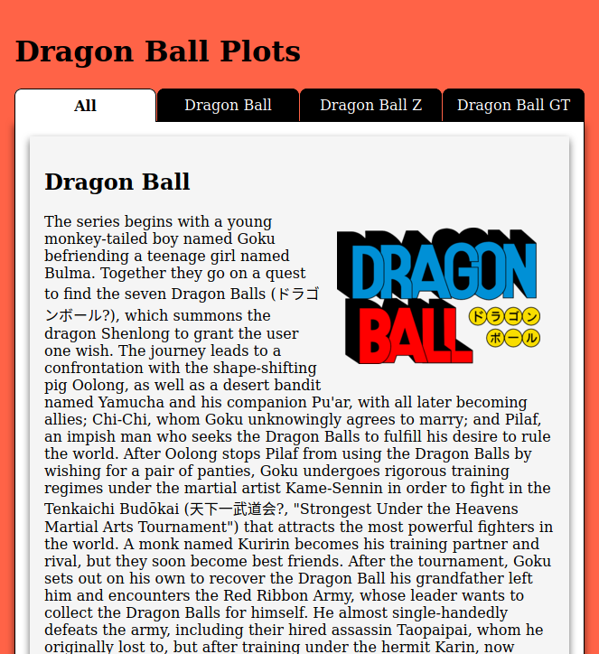
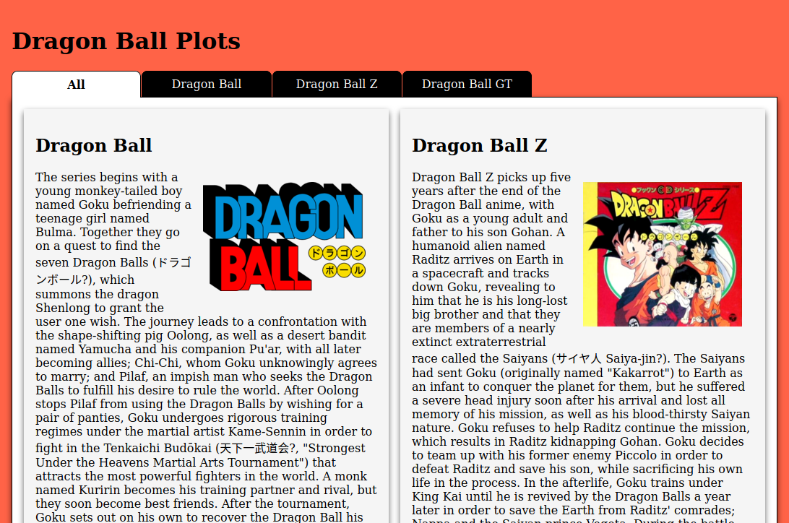
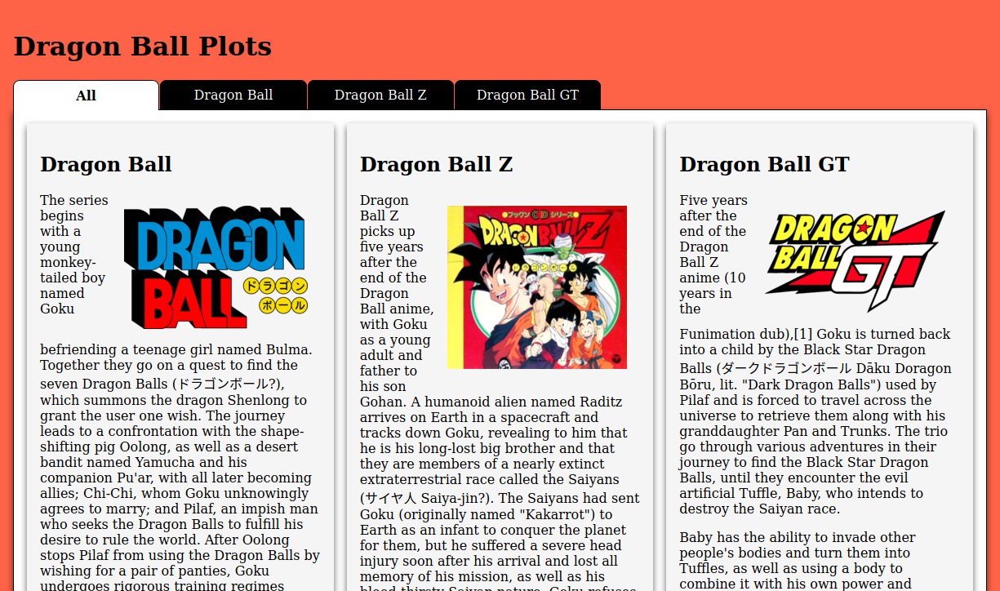
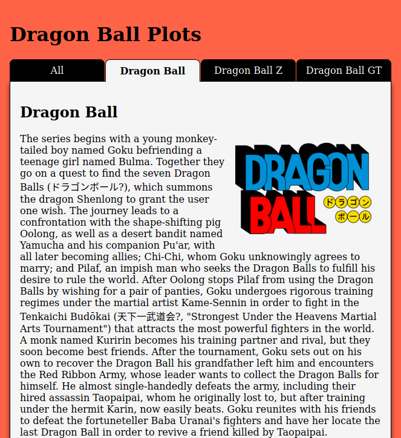
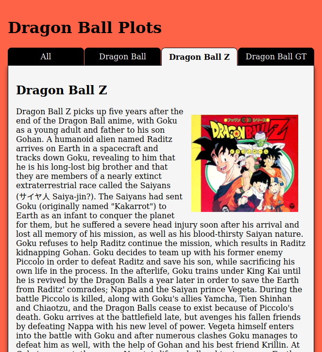
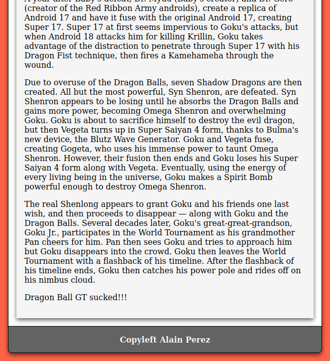

# Tabs Exercise

This exercise will use JavaScript to add tab funcitonalities to a web page.

## HTML

Create a header with the title and a navigation with 4 navigation items (see Image 3).

Create a section with 3 articles:

* Dragon Ball
* Dragon Ball Z
* Dragon Ball GT

Each article will have a title, a description and an image (e.g. get them from wikipedia).

There should be a footer with a "Copyright" message (see image 7).

## CSS

* Body background = "tomato";
* Seciton background = "white";
* Article background = "whitesmoke";

Section, footer and articles should have the same shadow.

### Navigation

Tabs background = "black";
Tab background when selected or when the mouse passes over it, should have section background when "all" tab is selected or article background when any other tab is selected.

Navigation should never have more than 720px.

### Section

Should adapt the number of columns depending on the width of the page:

* 1 column <720px (see Image 1).
* 2 columns from 720px-1200px (see Image 2).
* 3 columns >1200px (see Image 3).

When all tab is selected, the articles will not occupy the entire section. When a single article is selected, it should occupy the entire section.

There should be a space between each article.


*Image 1: Small Layout*


*Image 2: Medium Layout*


*Image 3: Large Layout*

### Article

The image should flow with the text. It should never occupy more width than the article itself.

When a single article is selected, it whould occupy the entire section. The color of hovered tabs and selected tab must also be the same as the article.

## JavaScript

Use Javascript just to add/remove classes to the DOM elements in this exercise. Do not add any styling directly.

When "All" tab is selected, all the articles should be visible (See Image 3*).


When any other tab is selected, just the article related to the navigation item should be visible.



*Image 4: Single Article DB*


*Image 5: Single Article DBZ*


*Image 6: Single Article DBGT*

***replace* function**
```javascript
let string = "Hello Mundua!";
let replaced_string = string.replace("Hello", "Kaixo");
console.log(replaced_string);
```
Prints Kaixo Mundua!

## Other considerations

Try to develop thinking that in the future the amount of articles could change.

For example, how could I minimize the changes if in the future I want to add "Dragon Ball Super" to the list of articles?

I should only change the HTML and the rest would work the same way.

Do not forget to style the footer!


*Image 7: Footer Styling*