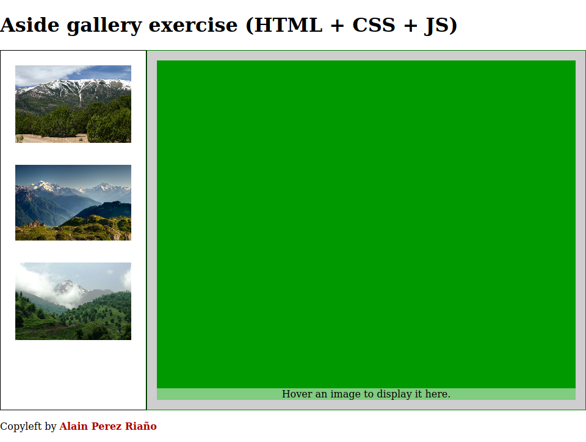

# Aside Gallery

You will receive a base HTML. **DO NOT MODIFY THE HTML FILE!**

You have to create a CSS and a JS file. 

## CSS

The app is a full page app. So it should occupy the entire viewport.

* **height**: The header & footer should use the needed height. The aside and the main seciton must use the rest of the height.
* **aside**: The aside should occupy 1 quarter of the width.
  * If the images occupy more than the maximum height, a scroll should appear only in the aside (see image 2).
  * The images should adapt to the width of the aside.
* **Main section**: It should occupy 3 quarters of the width.
  * The text should appear in the bottom of the div. It should also appear over the image (with some transparency so the image can be seen).
* **images**: All images should adapt to their containers.

*Image 1: Aside Gallery.*

*Image 2: Scrolling aside.*

## JS

* Add events listeners inside the JS files.
* When the user passes the mose over an aside image, the background image on the main section div should be the same as the hovered image (see image 3).
* The span inside the main section div should show the "alt" of the image (see image 3).
* When the mouse lets hovering the image, the main section div should be re-initialized (see image 1).

*Image 3: Mouse hovering aside.*
