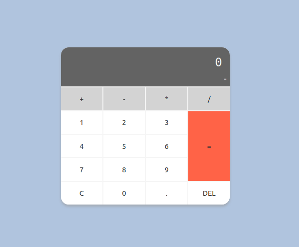
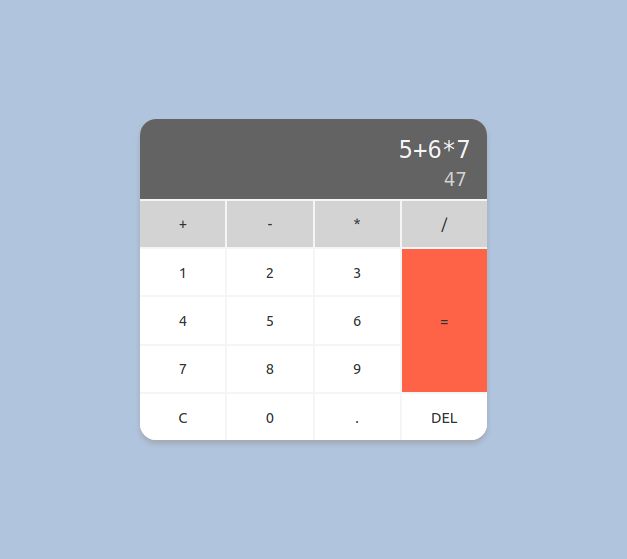

# Calculator Exercise

We want to create a web applicaiton that works as a simple calculator.

Use Grid for the calculator layout.

Calculator should appear in the center of the page.

*Image 1: Starting point.*

Display will have 2 rows:

1. The math calculation you want to solve.
1. The result (changes "on the fly").

*Image 2: Display rows.*

Once "=" button is clicked, the result will show in both lines.

*Image 3: '=' pressed.*

**C** should restart the display.

**DEL** should remove the last character from the display.

## Used colors

* #636363
* lightgray
* white
* lightsteelblue
* whitesmoke

## Tips

* See **eval** function.
* Do not create a function to each button, think how you could simplify the code.
